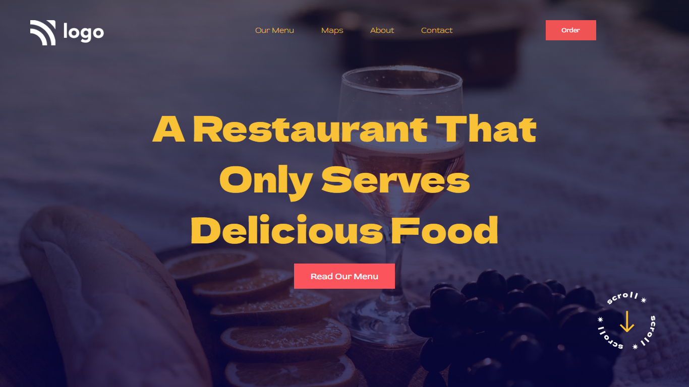

# Project 2 - Restaurant Landing Page

  

 

[DEPLOYED WEBSITE LINK](https://fsbproject2.netlify.app/)

## What I learned from this Project?

- I learned about **positions** in css.
- I also learned **linear gradient** for background image.

## Completed the project in **2** hours.